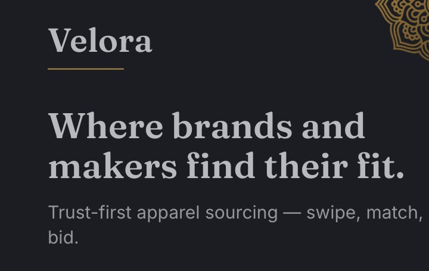
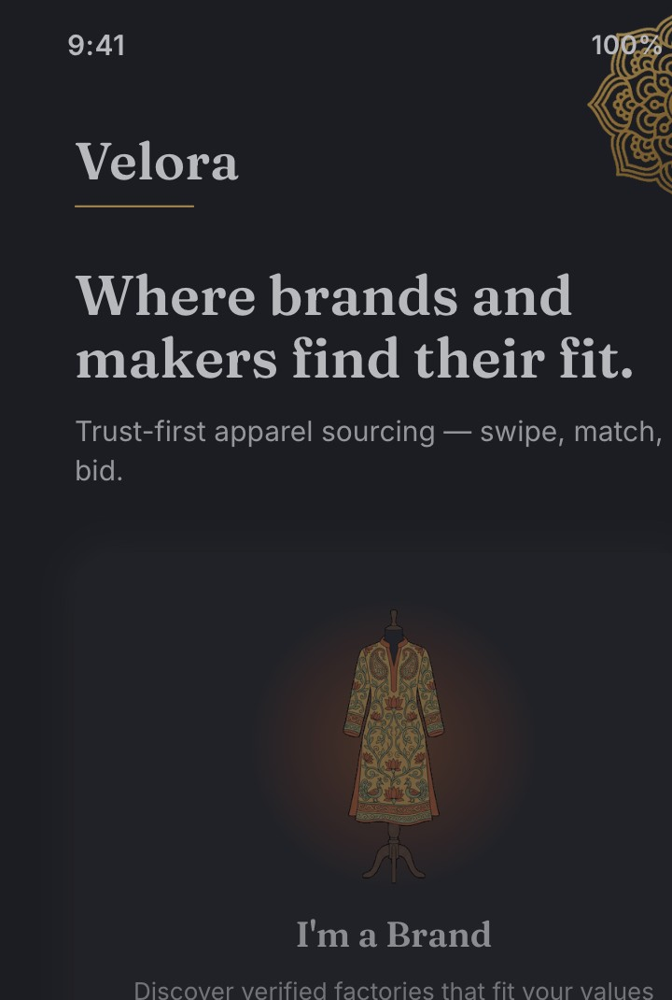
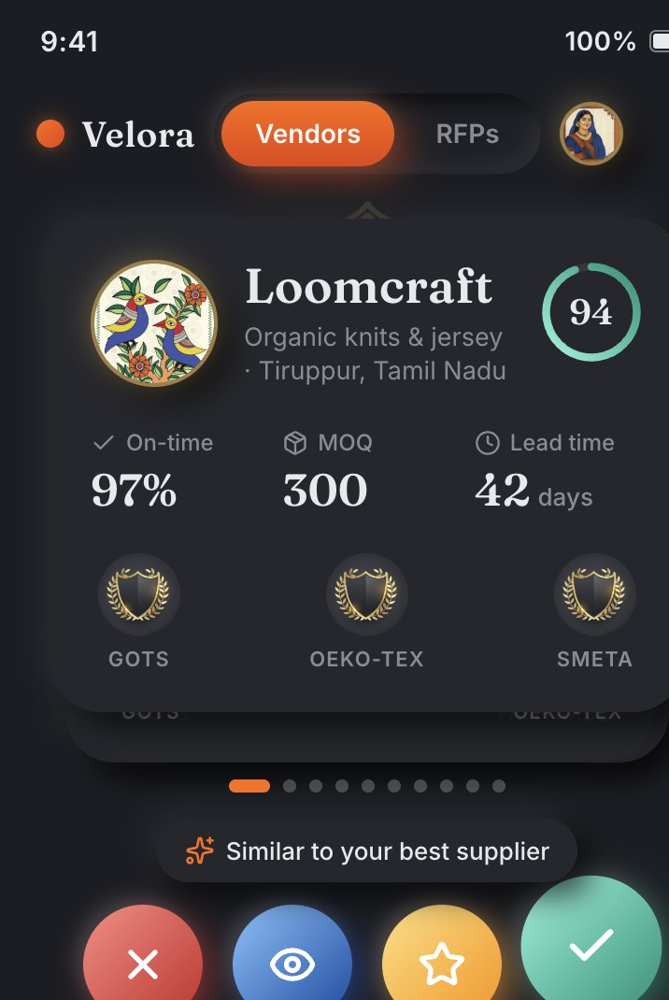
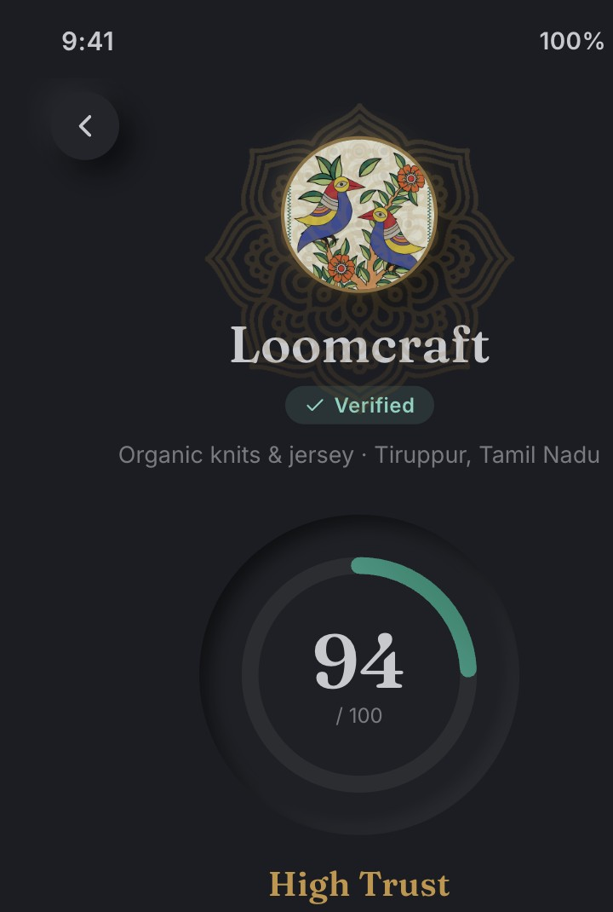
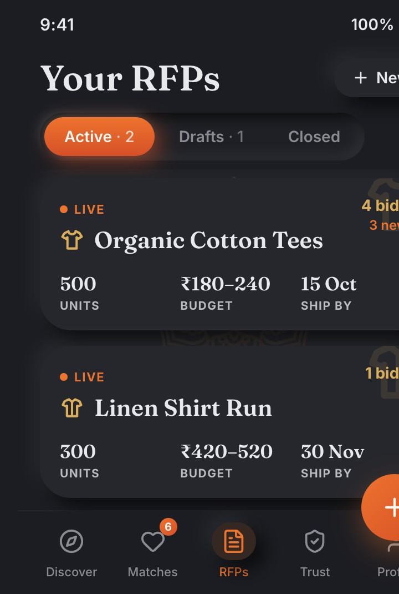
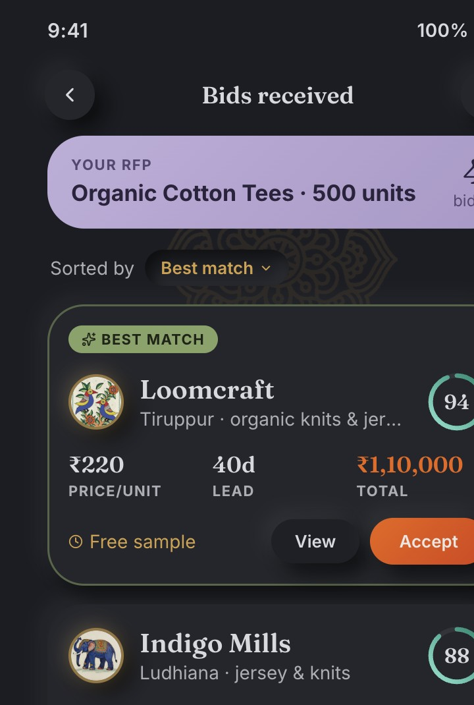
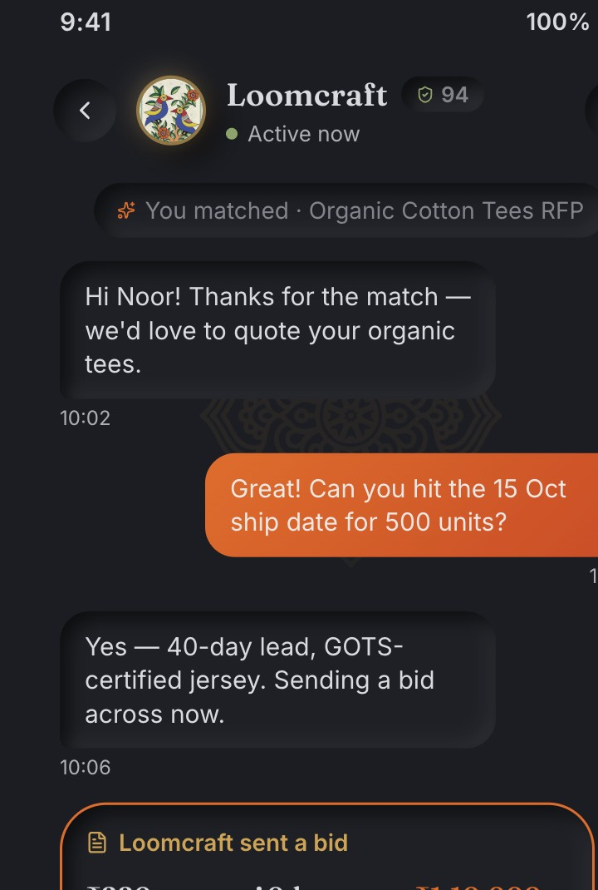
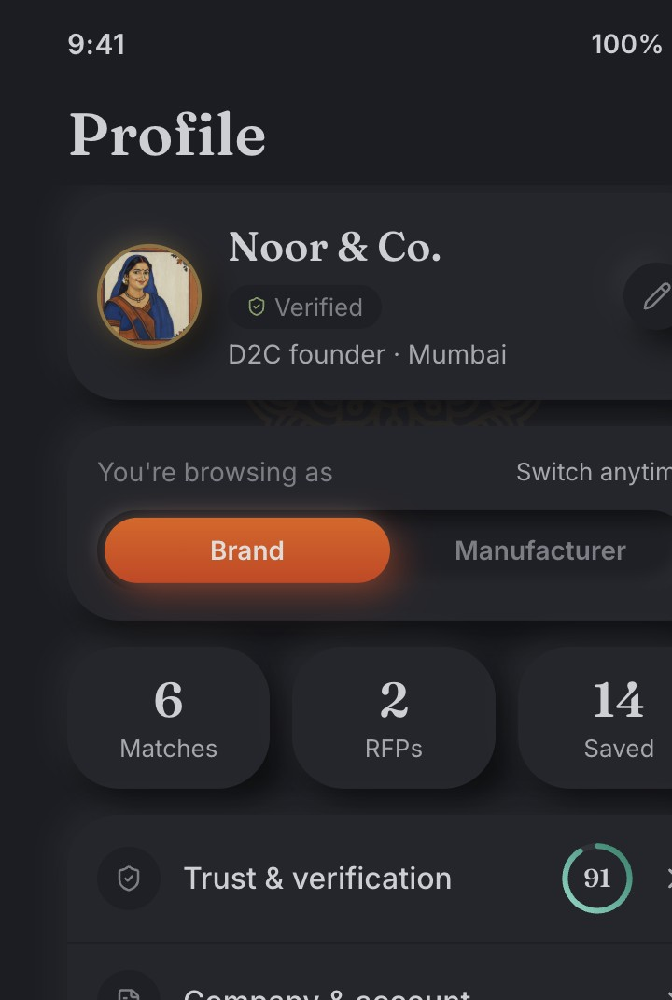

<p align="center">
  
</p>

<p align="center"><strong>Trust-first B2B apparel sourcing — swipe, match, and bid.</strong></p>
<p align="center">A mobile-first marketplace where fashion brands and garment manufacturers discover each other and close deals, with a portable trust score on every profile.</p>

<p align="center">
  
  
  
  
</p>

---

**Velora** turns apparel sourcing — normally slow, opaque, and gated by who you already know — into a two-sided discovery marketplace. **Brands** swipe through verified factories that fit their values, capacity, and certifications; **manufacturers** swipe through live RFPs from brands looking for exactly what they make. A match opens the door to chat and structured bidding, and every profile carries a **portable trust score** so credibility travels with you into each new relationship. It runs entirely on built-in demo data out of the box — no backend or keys required.

## Highlights

- **Swipe → Match → Bid** — the complete two-sided loop, closing end-to-end from discovery to a structured, accepted bid.
- **Dual role** — flip between Brand and Manufacturer and the whole app re-orients: the deck, navigation, and persona all switch.
- **Portable trust score** — a 0–100 trust gauge on every card, expanded in a Trust Profile into four pillars (*Identity, Capability, Reputation, Continuous*) plus verified certifications (GOTS, OEKO-TEX, SMETA).
- **RFPs & structured bids** — brands post RFPs (live / draft / closed with bid counts); manufacturers bid with price-per-unit, MOQ, lead time, and sample terms, and bids rank by best match.
- **In-app chat with inline bid cards** — matched parties message each other, and a submitted bid drops straight into the conversation thread.
- **Indian sourcing context** — rupee pricing with lakh-grouped numbers (e.g. ₹1,10,000) and hand-painted Kalighat *pat-chitra* folk-art avatars.
- **Motion that respects you** — spring-based swipe physics, an animated trust gauge, a match celebration, and page transitions — all `prefers-reduced-motion` aware.
- **Pluggable data layer** — ships on mock seed data with zero setup; add Supabase keys and it hydrates from Postgres instead, and the demo never breaks either way.

## Screenshots

> Captured from the running app in its native dark theme (Velora is a dark-only, mobile-first UI).

### Role Select — pick a side and the app re-orients


### Discover — swipe verified factories, each with a live trust gauge


### Trust Profile — a portable score across four pillars and verified certs


### RFPs — post and track live, draft, and closed briefs


### Bids received — structured bids ranked by best match


### Chat — in-app messaging with inline bid cards


### Profile — portable identity with a Brand ↔ Manufacturer switch


## Getting started

> Prerequisite: Node.js (18+). The app lives in the [`app/`](./app) directory.

```bash
cd app
npm install
npm run dev      # Vite dev server → http://localhost:5173
```

The app runs on built-in **mock data** out of the box — no backend or keys required.

```bash
npm run build    # type-check (tsc -b) + production build → app/dist
npm run preview  # serve the production build locally
```

### Optional: Supabase backend

Velora ships a **pluggable data layer**. With no keys it runs on mock seed data; add a Supabase project and it hydrates from your database instead. Copy `app/.env.example` to `app/.env.local`, fill `VITE_SUPABASE_URL` and `VITE_SUPABASE_ANON_KEY`, run `supabase/schema.sql`, then seed. See **[SUPABASE.md](./SUPABASE.md)** for the full setup.

## How it works

- **State is a single Zustand store**, seeded from mock data — the swipe / match / bid loop mutates it in memory (no persistence in demo mode).
- **Pluggable data layer** — an env-gated Supabase client (`app/src/lib/supabase.ts`) is the only place a client is built; with keys, `hydrateFromSupabase()` swaps the seed for live Postgres rows, otherwise the client is `null` and nothing touches the network.
- **Client-side SPA** — React 19 + React Router 7 (data router), styled with CSS Modules over a custom design-token system; Framer Motion drives the `SwipeDeck` (drag → fling → decision) and page transitions.
- **Mobile-first shell** — a `PhoneFrame` wraps every screen; at ≥768px it renders as a centered device bezel, and below that it goes full-bleed.

## Development

```bash
cd app
npm run dev        # dev server (http://localhost:5173)
npx tsc -b         # type-check (also runs as part of npm run build)
npm run lint       # oxlint
npm run test       # unit tests (Vitest)
npm run test:watch # tests in watch mode
```

## Credits & license

Velora is an original project (a design-and-build case study), not a fork. Built with **React**, **Vite**, **TypeScript**, **Supabase**, **Framer Motion**, **Zustand**, and **Lucide** icons; typeset in **Fraunces** (display) and **Inter** (UI). Its visual identity draws on **Kalighat *pat-chitra*** folk-art motifs and avatars, and a documented dark-neumorphic token system (see [`design-system.md`](./design-system.md)).

No open-source license file is included, so the default applies: **© the author — all rights reserved.** Add a `LICENSE` if you intend to open-source it.
